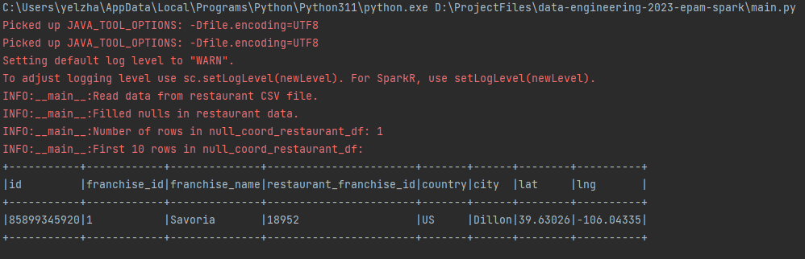
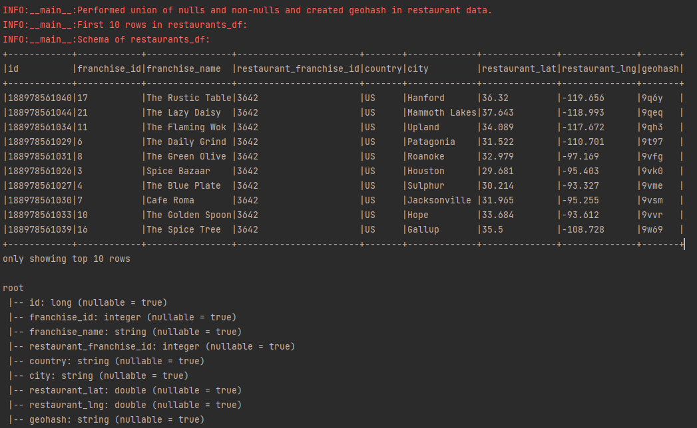
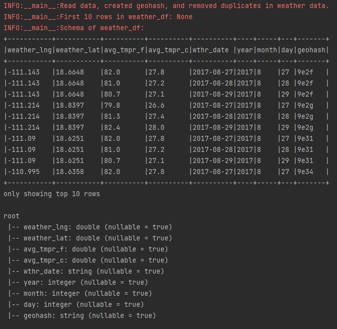
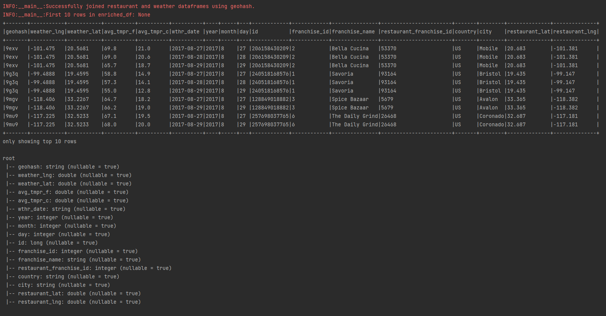

# data-engineering-2023-epam-spark

Link to the github: https://github.com/yelzha/data-engineering-2023-epam-spark

The WeatherRestaurantProject is a PySpark application designed for extracting, transforming, and loading (ETL) data related to restaurants and weather. This script uses PySpark to perform various operations on restaurant and weather data, creating an enriched dataset that is then saved in a partitioned Parquet format.

## Table of Contents
- [Task Description](#task-description)
- [Overview](#overview)
- [Requirements](#requirements)
- [Structure of Project](#structure-of-project)
- [Usage](#usage)
- [Screenshots and Scripts](#screenshots-and-scripts)
- [Mini-Guide how to install Pyspark, Jdk and hadoop](#mini-guide-how-to-install-pyspark-jdk-and-hadoop)

## Task Description
#### Task
- Check restaurant data for incorrect (null) values (latitude and longitude). For incorrect values, map latitude and longitude from the Open Cage Geocoding API in a job via the REST API. ✅
- Generate a geohash by latitude and longitude using a geohash library like geohash-java. Your geohash should be four characters long and placed in an extra column.✅
- Left-join weather and restaurant data using the four-character geohash. Make sure to avoid data multiplication and keep your job idempotent.
#### Note: Development and testing should be done locally in your IDE environment.
- Store the enriched data (i.e., the joined data with all the fields from both datasets) in the local file system, preserving data partitioning in the parquet format.✅
#### You are expected to:
- Upload the source code and implement tests✅
- Upload your fully documented homework with screenshots and comments in the task Readme MD file with the repo link. ✅

## Overview

The WeatherRestaurantProject performs the following key tasks:

1. Reads restaurant data from a CSV file, handling null coordinates by filling them using OpenCageApi information.\
2. Unions data with nulls and non-nulls, calculates geohash of coordinates, and processes the restaurant data.\
3. Reads weather data from a partitioned Parquet file.\
4. Applies geohash and drops duplicates in the weather data.\
5. Joins restaurant and weather dataframes using geohash, creating an enriched dataframe.\
6. Writes the repartitioned enriched dataframe to a Parquet file.\

## Requirements

- Python=3.11
- JDK=1.17
- Hadoop=3.3.5
#### Python packages:
- PySpark=3.5.0
- Pygeohash=1.2.0 (for getting hash using latitude and longitude)
- OpenCageApi=2.4.0 (for handling null coordinates in restaurant data)

Also add new file constants.py
```python
OpenCageGeocodeApiKey = "YOUR-API-KEY"
```

## Structure of Project

- [`main.py`](#mainpy): main file for all spark processes
- [`unzip.py`](#unzippy): utility file for extracting zip files. So useful
- [`udfs.py`](#udfspy): additional udfs file that contains vital functions and udfs
- [`tests.py`](#testspy): unit testing python file
- [`constants.py`](#constantspy): constant values and keys for api and so on, so fourth...
- `requirements.txt`: minimal needed packages
- `data/source`: place for source files
- `data/enriched`: place for output data or enriched partitioned parquet table

## Usage

To run the unzip.py script and extract zip files into a structured format, use the following command in your terminal

```bash
python -m pip install -r requirements.txt
```

To run the unzip.py script and extract zip files into a structured format, use the following command in your terminal

```bash
python unzip.py
```

To run the main, execute the following command in your terminal:

```bash
python main.py
```

#### Unittests

Tests are written using the Python unittest framework. \
To run the tests, execute the following command in your terminal:
```bash
python tests.py
```

## Screenshots and Scripts

1. Reads restaurant data from a CSV file, handling null coordinates by filling them using OpenCageApi information.\

2. Unions data with nulls and non-nulls, calculates geohash of coordinates, and processes the restaurant data.\

3. Reads weather data from a partitioned Parquet file.\
Applies geohash and drops duplicates in the weather data.\

4. Joins restaurant and weather dataframes using geohash, creating an enriched dataframe.\

5. Writes the repartitioned enriched dataframe to a Parquet file.\


### Plan of query:
```
== Physical Plan ==
AdaptiveSparkPlan isFinalPlan=false
+- SortAggregate(key=[geohash#318, year#306, restaurant_franchise_id#20, day#308, month#307], functions=[first(weather_lng#785, false), first(weather_lat#787, false), first(avg_tmpr_f#789, false), first(avg_tmpr_c#791, false), first(wthr_date#793, false), first(id#795L, false), first(franchise_id#797, false), first(franchise_name#799, false), first(country#801, false), first(city#803, false), first(restaurant_lat#805, false), first(restaurant_lng#807, false)])
   +- SortAggregate(key=[geohash#318, year#306, restaurant_franchise_id#20, day#308, month#307], functions=[partial_first(weather_lng#785, false), partial_first(weather_lat#787, false), partial_first(avg_tmpr_f#789, false), partial_first(avg_tmpr_c#791, false), partial_first(wthr_date#793, false), partial_first(id#795L, false), partial_first(franchise_id#797, false), partial_first(franchise_name#799, false), partial_first(country#801, false), partial_first(city#803, false), partial_first(restaurant_lat#805, false), partial_first(restaurant_lng#807, false)])
      +- Sort [geohash#318 ASC NULLS FIRST, year#306 ASC NULLS FIRST, restaurant_franchise_id#20 ASC NULLS FIRST, day#308 ASC NULLS FIRST, month#307 ASC NULLS FIRST], false, 0
         +- Project [geohash#318, weather_lng#785, weather_lat#787, avg_tmpr_f#789, avg_tmpr_c#791, wthr_date#793, year#306, month#307, day#308, id#795L, franchise_id#797, franchise_name#799, restaurant_franchise_id#20, country#801, city#803, restaurant_lat#805, restaurant_lng#807]
            +- SortMergeJoin [geohash#318], [geohash#145], Inner
               :- Sort [geohash#318 ASC NULLS FIRST], false, 0
               :  +- Exchange hashpartitioning(geohash#318, 200), ENSURE_REQUIREMENTS, [plan_id=1564]
               :     +- SortAggregate(key=[geohash#318, year#306, month#307, day#308], functions=[first(weather_lng#329, false), first(weather_lat#330, false), first(avg_tmpr_f#303, false), first(avg_tmpr_c#304, false), first(wthr_date#305, false)])
               :        +- SortAggregate(key=[geohash#318, year#306, month#307, day#308], functions=[partial_first(weather_lng#329, false), partial_first(weather_lat#330, false), partial_first(avg_tmpr_f#303, false), partial_first(avg_tmpr_c#304, false), partial_first(wthr_date#305, false)])
               :           +- Sort [geohash#318 ASC NULLS FIRST, year#306 ASC NULLS FIRST, month#307 ASC NULLS FIRST, day#308 ASC NULLS FIRST], false, 0
               :              +- Filter isnotnull(geohash#318)
               :                 +- GlobalLimit 1000000, 0
               :                    +- Exchange SinglePartition, ENSURE_REQUIREMENTS, [plan_id=1527]
               :                       +- LocalLimit 1000000
               :                          +- Project [lng#301 AS weather_lng#329, lat#302 AS weather_lat#330, avg_tmpr_f#303, avg_tmpr_c#304, wthr_date#305, year#306, month#307, day#308, pythonUDF0#835 AS geohash#318]
               :                             +- BatchEvalPython [get_geohash(lat#302, lng#301)#317], [pythonUDF0#835]
               :                                +- LocalLimit 1000000
               :                                   +- FileScan parquet [lng#301,lat#302,avg_tmpr_f#303,avg_tmpr_c#304,wthr_date#305,year#306,month#307,day#308] Batched: true, DataFilters: [], Format: Parquet, Location: InMemoryFileIndex(1 paths)[file:/D:/ProjectFiles/data-engineering-2023-epam-spark/data/source/wea..., PartitionFilters: [], PushedFilters: [], ReadSchema: struct<lng:double,lat:double,avg_tmpr_f:double,avg_tmpr_c:double,wthr_date:string>
               +- Sort [geohash#145 ASC NULLS FIRST], false, 0
                  +- Exchange hashpartitioning(geohash#145, 200), ENSURE_REQUIREMENTS, [plan_id=1563]
                     +- Filter isnotnull(restaurant_lat#805)
                        +- SortAggregate(key=[restaurant_franchise_id#20, geohash#145], functions=[first(id#17L, false), first(franchise_id#18, false), first(franchise_name#19, false), first(country#21, false), first(city#22, false), first(restaurant_lat#156, false), first(restaurant_lng#155, false)])
                           +- Sort [restaurant_franchise_id#20 ASC NULLS FIRST, geohash#145 ASC NULLS FIRST], false, 0
                              +- Exchange hashpartitioning(restaurant_franchise_id#20, geohash#145, 200), ENSURE_REQUIREMENTS, [plan_id=1557]
                                 +- SortAggregate(key=[restaurant_franchise_id#20, geohash#145], functions=[partial_first(id#17L, false), partial_first(franchise_id#18, false), partial_first(franchise_name#19, false), partial_first(country#21, false), partial_first(city#22, false), partial_first(restaurant_lat#156, false), partial_first(restaurant_lng#155, false)])
                                    +- Sort [restaurant_franchise_id#20 ASC NULLS FIRST, geohash#145 ASC NULLS FIRST], false, 0
                                       +- Union
                                          :- Project [id#17L, franchise_id#18, franchise_name#19, restaurant_franchise_id#20, country#21, city#22, lat#23 AS restaurant_lat#156, lng#24 AS restaurant_lng#155, pythonUDF0#837 AS geohash#145]
                                          :  +- BatchEvalPython [get_geohash(lat#23, lng#24)#144], [pythonUDF0#837]
                                          :     +- Project [id#17L, franchise_id#18, franchise_name#19, restaurant_franchise_id#20, country#21, city#22, lat#23, lng#24]
                                          :        +- Filter isnotnull(pythonUDF0#836)
                                          :           +- BatchEvalPython [get_geohash(lat#23, lng#24)#144], [pythonUDF0#836]
                                          :              +- Filter (isnotnull(lat#23) AND isnotnull(lng#24))
                                          :                 +- GlobalLimit 100000, 0
                                          :                    +- Exchange SinglePartition, ENSURE_REQUIREMENTS, [plan_id=1534]
                                          :                       +- LocalLimit 100000
                                          :                          +- FileScan csv [id#17L,franchise_id#18,franchise_name#19,restaurant_franchise_id#20,country#21,city#22,lat#23,lng#24] Batched: false, DataFilters: [], Format: CSV, Location: InMemoryFileIndex(1 paths)[file:/D:/ProjectFiles/data-engineering-2023-epam-spark/data/source/res..., PartitionFilters: [], PushedFilters: [], ReadSchema: struct<id:bigint,franchise_id:int,franchise_name:string,restaurant_franchise_id:int,country:strin...
                                          +- Project [id#127L, franchise_id#128, franchise_name#129, restaurant_franchise_id#130, country#131, city#132, pythonUDF0#840.lat AS restaurant_lat#833, pythonUDF0#840.lng AS restaurant_lng#834, pythonUDF0#841 AS geohash#832]
                                             +- BatchEvalPython [get_geohash(pythonUDF0#840.lat, pythonUDF0#840.lng)#144], [pythonUDF0#841]
                                                +- BatchEvalPython [get_coordinate(franchise_name#129, city#132, country#131)#40], [pythonUDF0#840]
                                                   +- Project [id#127L, franchise_id#128, franchise_name#129, restaurant_franchise_id#130, country#131, city#132]
                                                      +- Filter isnotnull(pythonUDF0#839)
                                                         +- BatchEvalPython [get_geohash(pythonUDF0#838.lat, pythonUDF0#838.lng)#144], [pythonUDF0#839]
                                                            +- BatchEvalPython [get_coordinate(franchise_name#129, city#132, country#131)#40], [pythonUDF0#838]
                                                               +- Filter (isnull(lat#133) OR isnull(lng#134))
                                                                  +- GlobalLimit 100000, 0
                                                                     +- Exchange SinglePartition, ENSURE_REQUIREMENTS, [plan_id=1542]
                                                                        +- LocalLimit 100000
                                                                           +- FileScan csv [id#127L,franchise_id#128,franchise_name#129,restaurant_franchise_id#130,country#131,city#132,lat#133,lng#134] Batched: false, DataFilters: [], Format: CSV, Location: InMemoryFileIndex(1 paths)[file:/D:/ProjectFiles/data-engineering-2023-epam-spark/data/source/res..., PartitionFilters: [], PushedFilters: [], ReadSchema: struct<id:bigint,franchise_id:int,franchise_name:string,restaurant_franchise_id:int,country:strin...


```

### Scripts:

#### `main.py`: 
```python
from udfs import geohash_udf, get_coordinate_udf

from pyspark.sql import SparkSession
from pyspark.sql import functions as F

import logging


def main() -> None:
    """
    Main ETL (Extract, Transform, Load) process for the WeatherRestaurantApp.

    This script performs the following tasks:
    1. Reads restaurant data from a CSV file, handling null coordinates by filling them using OpenCageApi information.
    2. Unions data with nulls and non-nulls, calculates geohash of coordinates, and processes the restaurant data.
    3. Reads weather data from a partitioned Parquet file.
    4. Applies geohash and drops duplicates in the weather data.
    5. Joins restaurant and weather dataframes using geohash, creating an enriched dataframe.
    6. Writes the repartitioned enriched dataframe to a Parquet file.

    :return: None
    """
    logger = logging.getLogger(__name__)
    logging.basicConfig(level=logging.INFO)

    try:
        spark = SparkSession \
            .builder \
            .master("local[*]") \
            .config("spark.app.name", "WeatherRestaurantApp") \
            .config("spark.io.compression.codec", "zstd") \
            .config("spark.sql.execution.pythonUDF.arrow.enabled", "true") \
            .config("spark.sql.execution.arrow.pyspark.enabled", "true") \
            .config("spark.sol.shuffle.partitions", 200) \
            .config("spark.driver.memory", "12g") \
            .config("spark.executor.memory", "12g") \
            .config("spark.executor.instances", 4) \
            .config("spark.executor.cores", 4) \
            .config("spark.sql.files.maxRecordsPerFile", 10_000) \
            .config("spark.executor.heartbeatInterval", "3600s") \
            .config("spark.network.timeout", "7200s") \
            .config("spark.network.timeoutInterval", "3600s") \
            .config("spark.driver.extraJavaOptions", "-Dlog4jspark.root.logger=WARN,console") \
            .config("spark.sql.debug.maxToStringFields", 200) \
            .enableHiveSupport() \
            .getOrCreate()

        # read data from restaurant csv file
        restaurants_df = spark.read \
            .option("header", "true") \
            .option('inferSchema', 'true') \
            .csv("data/source/restaurant_csv") \
            # .limit(100_000)

        logger.info("Read data from restaurant CSV file.")

        # filtering null data and fill it using OpenCageApi information
        null_coord_restaurant_df = restaurants_df \
            .filter(F.col('lat').isNull() | F.col('lng').isNull()) \
            .drop("lat", "lng") \
            .select("*", get_coordinate_udf(F.col('franchise_name'), F.col('city'), F.col('country')).alias("coord")) \
            .select(
                "*",
                F.col("coord.lat").alias("lat"),
                F.col("coord.lng").alias("lng")) \
            .drop("coord")

        logger.info("Filled nulls in restaurant data.")
        logger.info(f"Number of rows in null_coord_restaurant_df: {null_coord_restaurant_df.count()}")
        logger.info(f"First 10 rows in null_coord_restaurant_df:")
        null_coord_restaurant_df.show(10, truncate=False)

        # union data with nulls and non-nulls, and also get geohash of coordinates
        restaurants_df = restaurants_df \
            .filter(F.col('lat').isNotNull() & F.col('lng').isNotNull()) \
            .union(null_coord_restaurant_df) \
            .withColumn("geohash", geohash_udf(F.col("lat"), F.col("lng"))) \
            .withColumnsRenamed({'lat': 'restaurant_lat', 'lng': 'restaurant_lng'}) \
            .dropDuplicates(["restaurant_franchise_id", "geohash"])

        logger.info("Performed union of nulls and non-nulls and created geohash in restaurant data.")
        logger.info("First 10 rows in restaurants_df:")
        restaurants_df.show(10, truncate=False)
        logger.info("Schema of restaurants_df:")
        restaurants_df.printSchema()

        # reading weather data from partitioned parquet
        weather_df = spark.read.parquet("data/source/weather") \
            # .limit(1_000_000)

        # applying geohash adn dropping duplicates
        weather_df = weather_df \
            .withColumn("geohash", geohash_udf(F.col("lat"), F.col("lng"))) \
            .withColumnsRenamed({'lat': 'weather_lat', 'lng': 'weather_lng'}) \
            .dropDuplicates(["geohash", "year", "month", "day"])

        logger.info("Read data, created geohash, and removed duplicates in weather data.")
        logger.info(f"First 10 rows in weather_df: {weather_df.show(10, truncate=False)}")
        logger.info("Schema of weather_df:")
        weather_df.printSchema()

        # creating new dataframe joining restaurant to weather dataframe
        enriched_df = weather_df \
            .join(restaurants_df, on=["geohash"], how="left") \
            .filter(F.col("restaurant_lat").isNotNull()) \
            .dropDuplicates(["geohash", "year", "month", "day", "restaurant_franchise_id"])

        logger.info("Successfully joined restaurant and weather dataframes using geohash.")
        logger.info(f"First 10 rows in enriched_df: {enriched_df.show(10, truncate=False)}")
        logger.info("Schema of enriched_df:")
        enriched_df.printSchema()
        logger.info("Plan of query:")
        enriched_df.explain()

        # write saving previous partitioning
        enriched_df.repartition(3).write.partitionBy("year", "month", "day").mode("overwrite").parquet("data/enriched")
        logger.info("Successfully wrote repartitioned enriched dataframe.")

    except Exception as e:
        logger.error(f"An error occurred: {str(e)}")

    finally:
        spark.stop()
        logger.info("Successfully finished.")


if __name__ == '__main__':
    main()

```


#### `unzip.py`: 
```python
import zipfile
import os

_data_path = os.path.join(os.getcwd(), "data", "source")


def unzip_combine_weather_zips(weather_dir: str) -> None:
    """Unzipper for weather dataset.
    And combine all partitioned data into one directory and save its structure

    :param weather_dir: directory of weather file.
    """

    weather_subzips = [os.path.join(_data_path, weather_dir, file_name) for file_name in
                       os.listdir(os.path.join(_data_path, weather_dir))]

    for weather_subzip in weather_subzips:
        with zipfile.ZipFile(weather_subzip, "r") as weather_subfiles:
            weather_subfiles.extractall(f'{_data_path}/')


def unzip_restaurant_zip(restaurant_path: str) -> None:
    """Unzipper for restaurant dataset.

    :param restaurant_path: directory of weather file.
    """

    with zipfile.ZipFile(os.path.join(_data_path, restaurant_path), "r") as weather_subfiles:
        weather_subfiles.extractall(f'{_data_path}/')


if __name__ == "__main__":
    unzip_combine_weather_zips("weather_zip_folder")
    unzip_restaurant_zip("restaurant_csv.zip")

```


#### `udfs.py`: 
```python
from pyspark.sql import functions as F
from pyspark.sql.types import StructType, StructField, DoubleType, StringType

from opencage.geocoder import OpenCageGeocode
import pygeohash
import logging

# this is key saver... Create this file after cloning repos and define new variable OpenCageGeocodeApiKey with key
import constants

geocoder = OpenCageGeocode(constants.OpenCageGeocodeApiKey)


def get_coordinate(franchise_name: str, city: str, country: str) -> tuple:
    """
    Get geographical coordinates (latitude, longitude) for a given franchise name, city, and country.

    Args:
        franchise_name (str): The name of the franchise.
        city (str): The city associated with the franchise.
        country (str): The country code of the location.

    Returns:
        tuple: A tuple containing latitude and longitude. Returns (None, None) if geocoding fails.

    Note:
        This function relies on an external geocoding service.

    Raises:
        Exception: An exception is caught if geocoding fails for any reason.

    """
    query = f'{franchise_name}, {city}'
    try:
        coordinate = geocoder.geocode(query, countrycode=country.lower(), limit=1)
        if coordinate is not None:
            return coordinate[0]['geometry']['lat'], coordinate[0]['geometry']['lng']
        else:
            logging.warning(f"Geocoding no possible for {query}")
    except Exception as e:
        logging.warning(f"Geocoding failed for {query}. Error: {str(e)}")
    return None, None


def get_geohash(lat: float, lng: float) -> str:
    """
    Generate a geohash string based on the given latitude and longitude.

    Args:
        lat (float): Latitude coordinate.
        lng (float): Longitude coordinate.

    Returns:
        str: A geohash string representing the location.

    Note:
        This function uses the pygeohash library for geohashing.

    Warning:
        If either latitude or longitude is None, the function returns None and logs a warning.

    """
    if lat is None or lng is None:
        logging.warning(f"Geohash generation not possible. Latitude or longitude is missing.")
        return None
    if not ((-90.0 <= lat) and (lat <= 90.0)) or not ((-180.0 <= lng) and (lng <= 180.0)):
        logging.warning(f"Geohash generation not possible. Latitude or longitude is out of bound.")
        return None
    return pygeohash.encode(lat, lng, precision=4)


# schema with nullable latitude and longitude
coord_schema = StructType([
    StructField("lat", DoubleType(), True),
    StructField("lng", DoubleType(), True)
])

get_coordinate_udf = F.udf(get_coordinate, coord_schema)
geohash_udf = F.udf(get_geohash, StringType())

if __name__ == "__main__":
    # mini test
    print(get_coordinate("Savoria", "Dillon", "US"))
    print(get_geohash(181, 180))

```


#### `tests.py`: 
```python
import unittest
from pyspark.sql import SparkSession
from udfs import get_coordinate, get_geohash


class TestGeoFunctions(unittest.TestCase):
    def test_get_coordinate(self):
        # Positive test case: Valid coordinates
        result = get_coordinate("Savoria", "Dillon", "US")
        self.assertIsInstance(result, tuple)
        self.assertEqual(len(result), 2)
        self.assertIsInstance(result[0], float)
        self.assertIsInstance(result[1], float)

        # Negative test case: Invalid franchise and city
        result = get_coordinate("InvalidFranchise", "InvalidCity", "ZZ")
        self.assertIsInstance(result, tuple)
        self.assertEqual(len(result), 2)
        self.assertIsNone(result[0])
        self.assertIsNone(result[1])

        # Negative test case: Invalid country code
        result = get_coordinate("Savoria", "Dillon", "InvalidCountry")
        self.assertIsInstance(result, tuple)
        self.assertEqual(len(result), 2)
        self.assertIsNotNone(result[0])
        self.assertIsNotNone(result[1])

        # Negative test case: Missing franchise name
        result = get_coordinate("", "Dillon", "US")
        self.assertIsInstance(result, tuple)
        self.assertEqual(len(result), 2)
        self.assertIsNotNone(result[0])
        self.assertIsNotNone(result[1])

        # Negative test case: Missing city
        result = get_coordinate("Savoria", "", "US")
        self.assertIsInstance(result, tuple)
        self.assertEqual(len(result), 2)
        self.assertIsNone(result[0])
        self.assertIsNone(result[1])

    def test_get_geohash(self):
        # Positive test case: Valid coordinates
        result = get_geohash(1, -1)
        self.assertIsInstance(result, str)
        self.assertEqual(len(result), 4)

        # Negative test case: Missing latitude or longitude
        result = get_geohash(None, -1)
        self.assertIsNone(result)

        # Negative test case: Out of bound latitude or longitude
        result = get_geohash(181, -181)
        self.assertIsNone(result)

        # Positive test case: Coordinates within a specific range
        result = get_geohash(39.63026, -106.04335)
        self.assertIsInstance(result, str)
        self.assertEqual(len(result), 4)
        self.assertTrue(result.isalnum())  # Check if the result is alphanumeric


if __name__ == "__main__":
    unittest.main()

```


#### `constants.py`: 
```python
OpenCageGeocodeApiKey = "YOUR-API-KEY"

```

## Mini-Guide how to install Pyspark, Jdk and hadoop

https://dev.to/awwsmm/installing-and-running-hadoop-and-spark-on-windows-33kc

1. Install Python 3.11

2. Download JDK-11 or JDK-17

3. https://spark.apache.org/downloads.html \
Download spark-3.5.0-bin-hadoop 3.tgz \
After switching to C:/Spark

4. https://hadoop.apache.org/release/3.3.5.html \
Download, then run using 7-Zip as an administrator, unzip, unzip again. Pom peren. v C:/Hadoop

5. https://github.com/cdarlint/winutils/tree/master/hadoop-3.3.5/bin \
Download anything you want to transfer to C:/Hadoop/bin/

6. Add variables in Windows\
JAVA_HOME=C:/…\
HADOOP_HOME=C:/Hadoop\
SPARK_HOME=C:/Spark\
File path:\
%JAVA_HOME%/bin\
%HADOOP_HOME%/bin\
%SPARK_HOME%/bin\